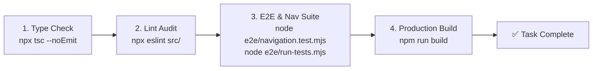

# AGENTS.md — Engineering & Agent Architecture Guide

> **AETHER-HUD** — High-End Tactical Portfolio & Dashboard Platform  
> **Core Concept:** Luxury Cybernetics / Tactical Glassmorphism (AAA Game HUD)  
> **Authority:** This document serves as the master engineering directive for all AI agents and engineers working on this codebase. It enforces architectural consistency, type safety, security, and quality gates across the entire system.

---

## 1. Core Mission & Principles

1. **Code Consistency & Precision:** Every file, component, route, and module must adhere to uniform design patterns, naming conventions, and structural boundaries.
2. **Strict Type Safety:** Zero tolerance for unsafe types (`any`), unhandled nulls, or loose type assertions.
3. **Resilient & Fail-Closed Architecture:** APIs and database queries must fail gracefully with structured responses without crashing the runtime or exposing sensitive data.
4. **Design System Fidelity:** All visual implementations must strictly comply with [DESIGNS.md](file:///Volumes/Reinshy/Workspace/Personal/Aether%20HUD/aether-hud/DESIGNS.md). Generic styling defaults (such as standard rounded corners) are strictly prohibited.
5. **Quality Verification Before Completion:** No code change is complete without passing all type checks, lint checks, test suites, and production build gates.

---

## 2. Technology Stack & Runtime Matrix

| Layer | Technology | Specification / Role |
|---|---|---|
| **Framework** | Next.js 16 (App Router) | Server & Client Components, Route Handlers, Metadata API |
| **Language** | TypeScript 5 (Strict Mode) | Strong typing, strict null checks, explicit return types |
| **UI Library** | React 19 | Server/Client rendering, React Hooks, Context API |
| **Styling** | Tailwind CSS v4 | CSS variable token theme, utility classes, `@theme inline` |
| **Database & ORM** | PostgreSQL + Prisma v7 | Prisma Client with `@prisma/adapter-pg` driver adapter |
| **Icons** | Lucide React | Tactical system icons with HUD color and stroke styling |
| **Animation** | Framer Motion & CSS | Easing curves `cubic-bezier(0.16, 1, 0.3, 1)`, HUD micro-interactions |
| **Testing** | Node.js E2E Test Suite | Automated route auditing, navigation verification, API schema tests |

---

## 3. Directory Architecture & Layer Responsibilities

```
aether-hud/
├── src/
│   ├── app/                         # Next.js App Router (Pages, Layouts, APIs)
│   │   ├── (public)/                # Landing portfolio pages & root layout
│   │   ├── dashboard/               # Tactical CMS Dashboard pages & views
│   │   ├── login/                   # Authentication view & login flow
│   │   ├── api/                     # REST API Route Handlers (JSON endpoints)
│   │   └── globals.css              # Master Design System CSS & Token definitions
│   │
│   ├── components/                  # Component Library (Strict Layering)
│   │   ├── ui/                      # Atomic HUD Primitives (Button, Card, Input, Modal, etc.)
│   │   ├── features/                # Domain-Specific Feature Blocks & Sub-views
│   │   ├── layout/                  # Global Layouts (HUD Header, Footer, Sidebar, Page Headers)
│   │   └── sections/                # Main Landing Page Sections (Hero, Projects, Skills, Contact)
│   │
│   ├── lib/                         # Core Infrastructure & Utilities
│   │   ├── prisma.ts                # Prisma v7 Client Singleton instance
│   │   ├── constants.ts             # Static configurations, routes, and data models
│   │   ├── utils.ts                 # `cn()` className utility (clsx + tailwind-merge)
│   │   ├── api-helpers.ts           # API response helpers and request parsers
│   │   ├── motion-variants.ts       # Shared Framer Motion animation configurations
│   │   ├── auth-context.tsx         # Client authentication state provider
│   │   └── sidebar-context.tsx      # Dashboard sidebar state provider
│   │
│   └── data/                        # Static fallback data & initial seed datasets
│       └── portfolio.ts             # Baseline portfolio data (Projects, Skills, Socials)
│
├── prisma/                          # Database Schema & Migrations
│   ├── schema.prisma                # Data models and provider configurations
│   ├── migrations/                  # Versioned SQL migration history
│   └── seed.ts                      # Database seeding script
│
├── e2e/                             # End-to-End & Integration Test Suites
│   ├── navigation.test.mjs          # Route accessibility, anchors, manifest, and icons audit
│   └── run-tests.mjs                # Production build & route validation runner
│
├── DESIGNS.md                       # Master UI/UX Design System Specification
└── AGENTS.md                        # Master Engineering Guide (This Document)
```

### Architectural Layering Rules:
- **`src/components/ui/`**: Must remain completely reusable and agnostic of business logic. Do not import API helpers or database clients here.
- **`src/components/features/`**: Houses domain-specific interactive blocks (e.g. `profile-preview-card.tsx`, `project-archive-row.tsx`). Decompose complex dashboard views into modular feature components.
- **`src/components/sections/`**: Landing page sections. Must be optimized for performance, responsive across all viewports, and visually immersive.
- **`src/app/api/`**: Pure backend route handlers. Never return raw HTML; always return structured JSON with appropriate HTTP status codes.

---

## 4. Coding Standards & Consistency Guidelines

### 4.1. TypeScript Strictness
- **No `any` or loose `unknown` casts:** Define explicit interfaces and type aliases for all payloads, props, state, and API responses.
- **Encapsulate Module-Private Types:** If a type or interface is only used within a single component/file, do NOT export it. Keep it module-private to prevent dead exports across the codebase.
- **Interface Naming:** Props interfaces must follow `[ComponentName]Props` (e.g. `ButtonProps`, `ProjectCardProps`).
- **Strict Return Types:** All utility functions and API handlers must have predictable and typed return values.

### 4.2. Component Architecture (Server vs. Client)
- **Default to Server Components:** Keep components as Server Components unless interactivity, browser APIs, or React Hooks (`useState`, `useEffect`, `useCallback`, `useContext`) are required.
- **Mark Client Components Explicitly:** Place `"use client";` at the very first line of interactive components.
- **Dynamic Imports for Heavy Dialogs:** Modals and heavy interactive sheets should utilize `next/dynamic` where suitable to keep initial bundle sizes minimal.
- **Accessible State Handling:** All interactive elements must support keyboard navigation, visible focus indicators (`focus-ring-gold`), proper `aria-*` attributes, and disabled states.

### 4.3. API Route Architecture & Security
- **Strict HTTP Method Guarding:** Check and enforce allowed HTTP methods (e.g. `GET`, `POST`, `PUT`, `DELETE`).
- **Fail-Closed Authentication:** Protected endpoints must validate the session or `DASHBOARD_SECRET` / `Authorization` header. If the secret is unset in environment variables, fail closed immediately (return HTTP `503` or `401`).
- **Structured Error Handling:** Wrap all API route logic in top-level `try/catch` blocks:
  ```typescript
  export async function GET(req: Request) {
    try {
      // Endpoint logic...
      return NextResponse.json({ data: result }, { status: 200 });
    } catch (error) {
      console.error("[API_ENDPOINT_TAG]", error instanceof Error ? error.message : error);
      return NextResponse.json(
        { error: "Failed to process request" },
        { status: 500 }
      );
    }
  }
  ```
- **No Secret Leakage:** Never include database connection strings, secret keys, or internal stack traces in client-facing error responses.

### 4.4. Database Operations (Prisma v7)
- **Singleton Client Instance:** Always import `prisma` from `@/lib/prisma`. Never instantiate new `new PrismaClient()` objects in route handlers or components.
- **Transactional Integrity:** For multi-step data mutations, always wrap queries in `prisma.$transaction([...])`.
- **Graceful Fallback / Dual-Engine Resilience:** If database connectivity is degraded or unconfigured, dashboard and public routes should fall back gracefully to the static dataset in `src/data/portfolio.ts` without crashing the application.

### 4.5. Design System Integration
- **Refer to [DESIGNS.md](file:///Volumes/Reinshy/Workspace/Personal/Aether%20HUD/aether-hud/DESIGNS.md) for All UI Decisions:** All colors, spacing, borders, chamfered cuts, glassmorphism layers, typography, and animations must strictly follow the tokens and patterns defined in `DESIGNS.md`.
- **Anti-Generic Enforcement:** Do NOT introduce generic styling (e.g., standard `rounded-lg` / `rounded-2xl` corners). All panels and buttons must use tactical chamfered polygons (`.chamfered`, `.tactical-btn`) or sharp HUD borders.

---

## 5. Quality Gates & Verification Workflow

Before completing any task or proposing changes, you MUST run and pass the following quality verification pipeline in sequence:



### Verification Commands:
1. **Type Safety Check:**
   ```bash
   npx tsc --noEmit
   ```
   *Expectation: 0 errors.*

2. **Lint & Code Style Audit:**
   ```bash
   npx eslint src/
   ```
   *Expectation: 0 errors and 0 warnings.*

3. **E2E & Navigation Test Suite:**
   ```bash
   node e2e/navigation.test.mjs
   node e2e/run-tests.mjs
   ```
   *Expectation: 100% tests passing.*

4. **Production Build Gate:**
   ```bash
   npm run build
   ```
   *Expectation: Clean build across all static and dynamic routes.*

---

## 6. Prohibited Anti-Patterns

- ❌ **No Git Protocol or Commit Automation:** Do not include automated git commit formats, branch scripts, or push rituals. Keep version control clean and standard.
- ❌ **No Cron Automation / Schedules:** Do not include cron tasks, scheduled agents (C1-C5), or background cron scripts.
- ❌ **No Generic Rounded Corners:** Never use `rounded-md`, `rounded-lg`, `rounded-xl`, `rounded-2xl`, `rounded-full` for tactical panels or cards. Use `.chamfered*` classes.
- ❌ **No Raw / Generic Spinners:** Do not use default `animate-spin`. Use the tactical HUD diamond spinner (`.hud-spinner`) or `.hud-rotate`.
- ❌ **No Dead Exports:** Do not export symbols, types, or helpers that are not imported by other modules.
- ❌ **No Hardcoded Secrets or Credentials:** Never commit credentials or assume default secrets. Fail closed when configuration is absent.
