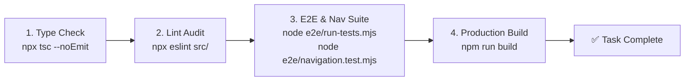

# AGENTS.md — Engineering & Agent Architecture Guide

> **TEYVAT CODEX** — Interactive Traveler Dossier & Codex Console
> **Core Concept:** Luxury Fantasy RPG / Illuminated Traveler Dossier
> **Authority:** This document is the master engineering directive for all AI agents and engineers on this codebase. It enforces architectural consistency, type safety, security and quality gates across the system.

---

## 1. Core Mission & Principles

1. **Code Consistency & Precision:** Every file, component, route and module adheres to uniform patterns, naming conventions and structural boundaries.
2. **Strict Type Safety:** Zero tolerance for `any`, unhandled nulls, or loose assertions. The wire contract lives in `src/lib/dto.ts`; never redefine it locally.
3. **Resilient & Fail-Closed Architecture:** The codex must render completely with **no database at all**, writes must be authenticated, and APIs must fail closed with structured errors instead of crashing or leaking internals.
4. **Design System Fidelity:** All visual work follows [DESIGNS.md](DESIGNS.md) — warm parchment, saddle leather, imperial gold, organic fantasy curves. Tactical/mecha styling (chamfered cuts, scanlines, monospace telemetry jargon, obsidian panels in light mode) is prohibited.
5. **Quality Verification Before Completion:** No change is complete until type check, lint, the e2e/navigation suites and the production build all pass.

---

## 2. Technology Stack & Runtime Matrix

|Layer|Technology|Specification / Role|
|---|---|---|
|**Framework**|Next.js 16 (App Router)|Server & Client Components, Route Handlers, Metadata API, ISR|
|**Language**|TypeScript 5 (Strict)|Strong typing, strict null checks, explicit return types|
|**UI Library**|React 19|Server/Client rendering, hooks, context|
|**Styling**|Tailwind CSS v4|CSS-variable token theme, `@theme`, parchment-only light palette|
|**Database & ORM**|PostgreSQL + Prisma v7|`PrismaClient` with the `@prisma/adapter-pg` driver adapter|
|**Icons**|Teyvat Codex artwork + typographic marks|Artwork from `public/ui-icons` via `src/components/ui/asset-icon.tsx` (`AssetIcon`); marks the pool lacks via `src/components/ui/codex-glyph.tsx` (`CodexGlyph`). No third-party icon library — ever|
|**Animation**|Framer Motion & CSS|Shared easing `EASE_CODEX` = `cubic-bezier(0.16, 1, 0.3, 1)`|
|**Testing**|Node.js E2E suite|Route auditing, navigation integrity, API schema and write-guard tests|

---

## 3. Directory Architecture & Layer Responsibilities

```
aether-hud/
├── src/
│   ├── app/
│   │   ├── page.tsx                  # Server composition root: fetches every dataset
│   │   ├── home-content.tsx          # Presentational homepage composition (client)
│   │   ├── projects/[id]/page.tsx    # Public domain dossier (server, static params)
│   │   ├── dashboard/                # Codex Console (auth-gated CMS)
│   │   ├── login/                    # Console sign-in
│   │   ├── api/                      # JSON route handlers
│   │   ├── opengraph-image.tsx       # Social share card (next/og)
│   │   └── globals.css               # Design tokens, theme scopes, class registry
│   │
│   ├── components/
│   │   ├── ui/                       # Business-logic-free primitives
│   │   │   ├── asset-icon.tsx        # ⚠ The only renderer of public/ui-icons art
│   │   │   ├── codex-glyph.tsx       # ⚠ Typographic marks (CODEX_GLYPHS)
│   │   │   ├── element-plate.tsx     # Skill vision medallion (element white art)
│   │   │   └── …                     # card, modal, badge, list-toolbar, pagination
│   │   ├── features/                 # Domain blocks (forms, cards, rows, panels)
│   │   ├── layout/                   # Shell: site header/footer, rail, dock, sidebar
│   │   └── sections/                 # Landing sections (prop-driven, server-rendered)
│   │
│   ├── lib/
│   │   ├── dto.ts                    # ⚠ THE wire contract for every payload
│   │   ├── portfolio-repo.ts         # ⚠ The only module that reads content (DB-or-fallback)
│   │   ├── navigation.ts             # ⚠ The only navigation registry
│   │   ├── ui-icons.ts               # ⚠ The only artwork registry + CODEX_GLYPHS marks
│   │   ├── element-assets.ts         # Teyvat elements + skill-category → vision
│   │   ├── session.ts                # HMAC session tokens (node:crypto)
│   │   ├── api-client.ts             # Typed client for dashboard mutations (ApiError)
│   │   ├── api-helpers.ts            # ok/fail/failNoDb/requireSession + cache headers
│   │   ├── use-list-controls.ts      # Search + sort + pagination + selection
│   │   ├── use-active-section.ts     # The single scroll-spy observer
│   │   ├── reorder.ts                # Adjacent `order` swap helper
│   │   ├── motion-variants.ts        # EASE_CODEX + shared variants
│   │   ├── prisma.ts                 # Prisma client singleton
│   │   ├── constants.ts              # Product identity + static data types
│   │   ├── auth-context.tsx          # Client session state (cookie-backed)
│   │   └── sidebar-context.tsx       # Console sidebar state
│   │
│   └── data/
│       ├── portfolio.ts              # Authored dataset (static-data mode + seed source)
│       └── sections.ts               # SECTION_FALLBACKS for the section registry
│
├── prisma/                           # schema.prisma, migrations/, seed.ts
├── e2e/                              # navigation.test.mjs, run-tests.mjs, test-server.mjs
├── DESIGNS.md                        # Master UI/UX specification
└── AGENTS.md                         # This document
```

### Architectural layering rules
- **`components/ui/`** — reusable, agnostic of business logic. Never import API helpers, the repo or `prisma` here.
- **`components/features/`** — domain blocks. Decompose complex console views into modular feature components rather than growing a view file.
- **`components/sections/`** — landing sections. They are **presentational**: props only, no fetching, no loading states (the homepage is server-rendered).
- **`app/api/`** — structured JSON only, never raw HTML.

---

## 4. Coding Standards & Consistency Guidelines

### 4.1 TypeScript strictness
- No `any` and no loose `unknown` casts. Define explicit interfaces for payloads, props and state.
- **Module-private types stay private.** A type used by one file must not be exported.
- Props interfaces are named `<Component>Props`.
- Utility functions and handlers have explicit, predictable return types.

### 4.2 Component architecture (Server vs Client)
- **Default to Server Components.** The homepage, project dossiers and all route wrappers are server components.
- Data fetching happens on the server through `src/lib/portfolio-repo.ts`; client components receive **props**. The only client-side fetches are console reads (`useData`) and mutations (`api-client`).
- Mark client components explicitly with `"use client";` as the first line.
- Heavy modals use `next/dynamic` with the existing loader overlay.
- All interactive elements support keyboard navigation, a visible focus indicator (`.codex-focus`), correct `aria-*` attributes and disabled states.

### 4.3 API route architecture & security
- **Method guarding**: check and enforce allowed HTTP methods.
- **Authentication**: every mutating handler starts with the session guard.
  ```ts
  const denied = requireSession(req);
  if (denied) return denied;
  if (!hasDatabase()) return failNoDb("PROJECTS_POST");
  ```
  `requireSession` fails closed: `503` when `DASHBOARD_SECRET` is unset, `401` on a missing/invalid/expired cookie. `/api/contact` and `/api/telemetry` are intentionally public.
- **Sessions** are HMAC-signed `httpOnly` cookies minted by `src/lib/session.ts`. Never reintroduce client-stored tokens — the previous base64 `sessionStorage` blob was forgeable.
- **Static-data mode**: when `DATABASE_URL` is absent, every read is served from `src/data/*` and every write returns `503` with an explanatory message. Use `failNoDb(tag)`; never let a write attempt a Prisma call it cannot complete.
- **Structured errors**: wrap handler logic in `try/catch` and return `fail(message, "TAG", status)`.
- **No secret leakage**: never return connection strings, secrets or stack traces to clients.

### 4.4 Database operations (Prisma v7)
- Import the singleton: `import { prisma } from "@/lib/prisma"`. Never construct `new PrismaClient()` elsewhere.
- **Reads go through `src/lib/portfolio-repo.ts`** — the single place implementing dual-engine resilience (database first, authored dataset on any failure, with a tagged `console.warn`).
- Multi-step mutations use `prisma.$transaction([...])` (see `/api/config/reset`).
- The console must stay fully usable in static-data mode: lists render the fallback dataset, mutations report the 503 message visibly.

### 4.5 Public rendering strategy
- **`/` (dossier)** — statically generated with `revalidate = 300`. It is content, not a feed; the console's edits appear within the revalidation window.
- **`/projects/[id]` (domain dossier)** — rendered per request (`dynamic = "force-dynamic"`). It must be reachable the moment a domain is published, and a prerendered/ISR dynamic segment served the not-found render with HTTP 200. `dynamicParams = false` would produce a real 404 but would also 404 every newly published domain until the next deploy — broken links from the homepage — so the route stays dynamic and the not-found page carries `noindex, nofollow` for unknown ids.
- Everything else under the console is client-rendered behind the session guard.

### 4.6 Design system integration
- Every colour, spacing value, border, radius, glass layer, typography choice and animation comes from the tokens and classes in `src/app/globals.css` (registry: DESIGNS.md §6).
- The palette is parchment-only and light-only: there is no theme switch, no `dark:` variant and no OS-scheme dependency. Never reintroduce a second palette.
- **Radius policy:** panels `rounded-3xl`, cards and controls `rounded-2xl` / `rounded-xl`, pills and dots `rounded-full`. `rounded-none` is forbidden.
- Prefer the class registry (`.codex-panel`, `.codex-card`, `.codex-label`, `.codex-input`, `.codex-btn-primary`, …) over re-deriving those styles with utilities.

---

## 5. Quality Gates & Verification Workflow


```mermaid
flowchart LR
    A["1. Type Check<br/>npx tsc --noEmit"] --> B["2. Lint Audit<br/>npx eslint src/"]
    B --> C["3. E2E & Nav Suite<br/>node e2e/run-tests.mjs<br/>node e2e/navigation.test.mjs"]
    C --> D["4. Production Build<br/>npm run build"]
    D --> E["✅ Task Complete"]
```

1. **Type safety:** `npx tsc --noEmit` → 0 errors.
2. **Lint:** `npx eslint src/` → 0 errors, 0 warnings.
3. **E2E & navigation:** `node e2e/run-tests.mjs && node e2e/navigation.test.mjs` → 100% passing. The suite runs against a production build on `TEST_PORT` (default `3005`).
4. **Production build:** `npm run build` → clean across static and dynamic routes.

No database is required for any of the above: verification runs in static-data mode, which is the shipped default.

---

## 6. Prohibited Anti-Patterns

- ❌ **Tactical / mecha styling** — 45° chamfered cuts, scanlines, `.rounded-none`, monospace telemetry jargon (`SYS_NODE // 0x482A`, `DASH//01`, `[ERR_NODE]`), obsidian/slate cards in light mode, faint ghost text.
- ❌ **Generic spinners** — never `animate-spin` / a plain rotating circle. Use the elemental diamond rotation (`.elemental-rotate`, `CodexLoader`).
- ❌ **A second navigation array** — `PUBLIC_NAV` / `DASHBOARD_NAV` in `src/lib/navigation.ts` are the only nav registries. Declaring another is a defect (guarded by `e2e/navigation.test.mjs`).
- ❌ **A second wire type** — `src/lib/dto.ts` owns every payload shape.
- ❌ **Client-held credentials** — no tokens in `localStorage`/`sessionStorage`; sessions are `httpOnly` cookies.
- ❌ **Unhandled mutation failures** — every mutation goes through `@/lib/api-client` and surfaces `ApiError.message` to the operator. A silent `console.error` is a defect.
- ❌ **Dead exports** — no symbols, types or helpers that nothing imports.
- ❌ **Hardcoded secrets** — never commit credentials or assume a default secret. Absent configuration fails closed.
- ❌ **Regression-pinning tests** — tests assert observable behaviour; they never pin source text that a legitimate refactor would change.
- ❌ **Git automation & cron** — no commit-format scripts, branch rituals, or scheduled agents.

<!-- BEGIN:nextjs-agent-rules -->

# This is NOT the Next.js you know

This version has breaking changes — APIs, conventions, and file structure may all differ from your training data. Read the relevant guide in `node_modules/next/dist/docs/` (resolved from this file's directory; in monorepos the `next` package may not be visible from the repo root) before writing any code. Heed deprecation notices.

This block is written and re-added by `next dev` — verify at `node_modules/next/dist/server/lib/generate-agent-files.js`. Removing it from a diff only re-creates the uncommitted change; committing it with your work keeps the tree clean.

<!-- END:nextjs-agent-rules -->
