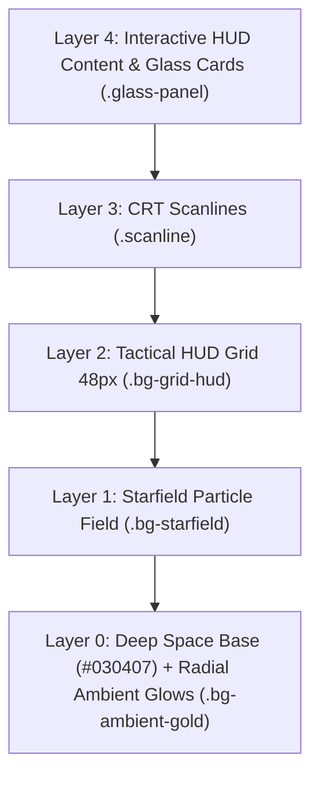

# DESIGNS.md — Master UI/UX Design System Specification

> **AETHER-HUD Design System: Obsidian & Imperial Gold Edition**  
> **Aesthetic Philosophy:** Luxury Cybernetics / Tactical Glassmorphism (AAA Game HUD)  
> **Inspirations:** *Honkai: Star Rail* (Luxury Sci-Fi Elegance), *Cyberpunk 2077* (Tactical HUD Telemetry), *Armored Core* (Mechanical Angular Precision).

---

## 1. Design Philosophy & Vision

The AETHER-HUD design system translates the high-density, hyper-responsive interface of AAA tactical games into an ultra-modern web experience. Every panel, button, and indicator is designed as an active subsystem node in an advanced cybernetic operating system.

### Core Aesthetic Pillars:
1. **Obsidian Depth:** Deep space surfaces (`#030407`) layered with frosted tactical glass cards and subtle ambient radial glows.
2. **Imperial Gold & Platinum Accents:** High-contrast, luxurious metallic hierarchy that directs user focus without visual clutter.
3. **Mechanical Angularity (Chamfered Cuts):** Rejection of generic rounded corners in favor of 45-degree polygon cuts and precision framing.
4. **Active HUD Telemetry:** Monospaced data tags (`[SYS_NODE]`, `NODE//01`), corner brackets, crosshairs, pulsing status LEDs, and scanline overlays.
5. **Fluid Cybernetic Motion:** High-performance animations using custom easing (`cubic-bezier(0.16, 1, 0.3, 1)`) with full accessibility fallbacks.

---

## 2. Non-Negotiable Anti-Generic Rules

> [!CAUTION]
> **STRICT PROHIBITION OF GENERIC ROUNDED CORNERS**  
> Never use standard web roundings (`rounded-md`, `rounded-lg`, `rounded-xl`, `rounded-2xl`, `rounded-full`) on core tactical panels, cards, buttons, or badges.  
> **Always** use chamfered polygon clipping (`.chamfered`, `.chamfered-sm`, `.chamfered-xs`, `.chamfered-lg`, `.tactical-btn`) or sharp HUD borders.

| Generic Web Default (FORBIDDEN ❌) | Tactical HUD Standard (REQUIRED ✅) |
|---|---|
| `rounded-lg` / `rounded-xl` / `rounded-2xl` on cards | `chamfered` / `chamfered-sm` / `chamfered-lg` with `glass-panel` |
| `rounded-md` on buttons | `tactical-btn` with `btn-glow-sweep` |
| Standard round pill badges (`rounded-full`) | `tech-badge` (hexagonal clip-path) or `chamfered-xs` |
| Generic circular spinners (`animate-spin`) | `hud-spinner` (diamond 45° rotation) or `hud-rotate` |
| Plain solid grey input boxes | `input-recessed` with subtle inset shadow and gold focus ring |
| Continuous unbroken progress bars | `segment-bar` with active tactical blocks |

---

## 3. Complete Design Token Registry

All tokens are defined in [src/app/globals.css](file:///Volumes/Reinshy/Workspace/Personal/Aether%20HUD/aether-hud/src/app/globals.css) via `@theme inline`.

### 3.1. Surface & Background Tokens

```css
--color-deep-space: #030407;         /* Deepest viewport canvas background */
--color-surface-primary: #0a0c10;    /* Solid primary container surface */
--color-surface-overlay: rgba(15, 18, 26, 0.75); /* High-density backdrop overlay */
--color-glass-card: rgba(20, 24, 35, 0.45);      /* Standard translucent glass card */
```

### 3.2. Metallic & Accent Color Scales

#### Imperial Gold Scale (Primary Luxury Accent)
| Token | Hex Value | Usage |
|---|---|---|
| `--color-gold-50` | `#fef9e7` | Brightest highlight / sparkle |
| `--color-gold-100` | `#fdf0c9` | High-contrast text accent |
| `--color-gold-200` | `#fbe39b` | Light hover state |
| `--color-gold-300` | `#f9d36d` | Hover active glow |
| `--color-gold-400` | `#f2c94c` | **Primary Brand Gold** (Buttons, active borders) |
| `--color-gold-500` | `#e2b93b` | Gradient end-stop / Darker gold |
| `--color-gold-600` | `#c19a32` | Subtle borders & inactive gold accents |
| `--color-gold-700` | `#a07e28` | Deep gold borders |
| `--color-gold-800` | `#7c631e` | Ambient low-contrast gold |
| `--color-gold-900` | `#5c4a14` | Shadow / Under-glow tone |

#### Titanium & Platinum Scale (Secondary Metallic)
| Token | Hex Value | Usage |
|---|---|---|
| `--color-platinum-50` | `#f4f6f8` | Ultra-bright white metallic text |
| `--color-platinum-100` | `#e0e6ed` | Primary body title metallic highlight |
| `--color-platinum-200` | `#c7d0db` | Secondary tactical text |
| `--color-platinum-300` | `#adb6c4` | Muted metallic labels |

#### Stellar Energy Scale (Emerald & Cyan Energy)
| Token | Hex Value | Usage |
|---|---|---|
| `--color-stellar-400` | `#38ef7d` | Emerald active telemetry & status |
| `--color-stellar-500` | `#00d2ff` | Cyan energy conduit & gradient counterpoint |
| `--color-stellar-600` | `#00a8cc` | Deeper cyan gradient accent |

#### HUD Status Indicators
| Token | Hex Value | Semantic State |
|---|---|---|
| `--color-hud-active` | `#00ff87` | System Online / Active / Success |
| `--color-hud-warning` | `#ff9900` | System Degraded / Caution / Pending |
| `--color-hud-danger` | `#ff0055` | Error / Alert / Critical Breach |

### 3.3. Glass Layers & Borders

```css
--color-glass-100: rgba(255, 255, 255, 0.03); /* Subtle card highlight */
--color-glass-200: rgba(255, 255, 255, 0.06); /* Inactive interactive hover */
--color-glass-300: rgba(255, 255, 255, 0.10); /* Elevated container surface */
--color-glass-400: rgba(255, 255, 255, 0.15); /* Strong border highlight */

--color-border-glass: rgba(242, 201, 76, 0.25);   /* Standard gold-tinted glass border */
--color-border-subtle: rgba(220, 225, 235, 0.12); /* Quiet titanium boundary */
--color-border-active: #f2c94c;                   /* Focused / Active node border */
```

### 3.4. Theme Presets

The interface supports dynamic telemetry themes via `data-theme` on the root container:

1. **Default (`obsidian-gold`):** Obsidian deep space with Imperial Gold accents and warm ambient light.
2. **`night-ops` (`data-theme="night-ops"`):** Tactical stealth mode with Stellar Green (`#38EF7D`) borders, active cyan pulse (`#00D2FF`), and emerald text gradients.
3. **`titanium` (`data-theme="titanium"`):** Monochromatic high-tech engineering mode with platinum borders (`#E0E6ED`) and silver metallic gradients.

---

## 4. Typography Hierarchy & System Labels

Typography is strictly paired to balance futuristic cybernetics with crystal-clear readability.

```
Display Headings  ──► Orbitron / Chakra Petch (Geometric, All-Caps, Tracked)
Body & Content    ──► Inter / Plus Jakarta Sans (Clean, High Legibility)
Telemetry & Code  ──► JetBrains Mono / Share Tech Mono (Monospace, Precise)
```

### 4.1. Text Styling Classes

- **Display Title Gradient:**
  ```html
  <h1 class="font-display text-4xl font-bold tracking-wider uppercase text-gradient-gold">
    COMMAND OVERVIEW
  </h1>
  ```
- **Monospace System Label:**
  ```html
  <span class="sys-label">SYS_REF // 0x482A</span>
  ```
- **Active Gold Telemetry Label:**
  ```html
  <span class="sys-label-gold">SECURITY_STATUS // NOMINAL</span>
  ```
- **Active Online Indicator:**
  ```html
  <span class="sys-label-active">ONLINE</span>
  ```

---

## 5. Geometry, Clipping & Tactical Embellishments

### 5.1. Chamfered Corner System (45-Degree Polygon Clipping)

```css
/* Standard Card Cut (16px top-right and bottom-left) */
.chamfered {
  clip-path: polygon(0 0, calc(100% - 16px) 0, 100% 16px, 100% 100%, 16px 100%, 0 calc(100% - 16px));
}

/* Small Card / Tag Cut (8px) */
.chamfered-sm {
  clip-path: polygon(0 0, calc(100% - 8px) 0, 100% 8px, 100% 100%, 8px 100%, 0 calc(100% - 8px));
}

/* Micro Cut (4px for small status pills) */
.chamfered-xs {
  clip-path: polygon(0 0, calc(100% - 4px) 0, 100% 4px, 100% 100%, 4px 100%, 0 calc(100% - 4px));
}

/* Large Hero Panel Cut (24px) */
.chamfered-lg {
  clip-path: polygon(0 0, calc(100% - 24px) 0, 100% 24px, 100% 100%, 24px 100%, 0 calc(100% - 24px));
}

/* Tactical Button Double Cut (12px top-left and bottom-right) */
.tactical-btn {
  clip-path: polygon(12px 0, 100% 0, 100% calc(100% - 12px), calc(100% - 12px) 100%, 0 100%, 0 12px);
}
```

### 5.2. Decorative HUD Overlays

- **`.corner-brackets`:** Inserts glowing gold top-left and bottom-right brackets framing the container.
- **`.corner-decor`:** Injects a subtle monospace `+` sign at the bottom-left corner.
- **`.sys-node`:** Injects an automated `[SYS_NODE]` telemetry tag at the bottom-right corner.
- **`.diamond-corner`:** Renders a subtle `◆` diamond symbol in the upper right.
- **`.angled-bar`:** Adds a glowing horizontal light gradient across the top border.
- **`.tech-badge`:** Renders a hexagonal clipped monospace tag with subtle titanium fill and gold border:
  ```html
  <span class="tech-badge">NEXT.JS 16</span>
  ```

---

## 6. Atmosphere & Background Layering

The UI depth is built through layered atmospheric overlays that create the sensation of a physical holographic display:



### Ambient Background Classes:
- **`scanline`:** CRT micro-scanline texture overlay.
- **`bg-grid-hud`:** Precision 48px coordinate grid.
- **`bg-starfield`:** Multi-layered procedural particle starfield.
- **`bg-ambient-gold`:** Warm gold radial light beam from the top-center.
- **`bg-ambient-violet`:** Subtle deep violet ambient accent light.

---

## 7. Component Blueprints & Code Standards

### 7.1. Tactical Glass Panel
```html
<div class="chamfered glass-panel p-6 corner-decor diamond-corner card-lift">
  <div class="flex items-center justify-between mb-4">
    <span class="sys-label">MODULE // 01</span>
    <span class="led-active" aria-label="Status active"></span>
  </div>
  <h3 class="font-display text-lg font-bold text-platinum-50 uppercase tracking-wider">
    Telemetry Engine
  </h3>
  <p class="text-text-muted text-sm mt-2">
    Real-time streaming analytics and system metrics.
  </p>
</div>
```

### 7.2. Tactical Button (CTA)
```html
<!-- Primary Gold Action Button -->
<button class="tactical-btn btn-glow-sweep focus-ring-gold px-6 py-2.5 text-sm font-medium bg-gradient-to-r from-gold-600 to-gold-500 text-deep-space hover:from-gold-500 hover:to-gold-400 inline-flex items-center gap-2">
  <span>DEPLOY SYSTEM</span>
</button>

<!-- Secondary Glass Button with Crosshair Reticle -->
<button class="tactical-btn crosshair-ring focus-ring-gold px-6 py-2.5 text-sm font-medium bg-glass-card border border-border-glass text-gold-400 hover:bg-[rgba(242,201,76,0.12)] inline-flex items-center gap-2">
  <span>INSPECT ARCHIVE</span>
</button>
```

### 7.3. Recessed Form Input
```html
<div class="space-y-1.5">
  <label class="sys-label">API_KEY // TOKEN</label>
  <input 
    type="text" 
    placeholder="Enter secret token..." 
    class="chamfered-sm input-recessed w-full px-4 py-2.5 text-sm font-mono focus-ring-gold"
  />
</div>
```

### 7.4. Tactical Segment Progress Bar
```html
<div class="skillbar-hover space-y-1.5">
  <div class="flex justify-between items-center text-xs font-mono">
    <span class="text-platinum-100">SYSTEM PERFORMANCE</span>
    <span class="text-gold-400">92%</span>
  </div>
  <div class="segment-bar" role="progressbar" aria-valuenow="92" aria-valuemin="0" aria-valuemax="100">
    <div class="segment active"></div>
    <div class="segment active"></div>
    <div class="segment active"></div>
    <div class="segment active"></div>
    <div class="segment active"></div>
    <div class="segment"></div>
  </div>
</div>
```

### 7.5. HUD Diamond Spinner & Rotating Icon
```html
<!-- Diamond Spinner for button and full-page loading -->
<span class="hud-spinner h-4 w-4" aria-hidden="true"></span>

<!-- HUD Rotate for inline icon refreshing -->
<svg class="hud-rotate h-4 w-4 text-gold-400" ...></svg>
```

### 7.6. HUD Skeleton Shimmer
```html
<!-- Tactical loading block: no rounded corners, energy-sweep shimmer -->
<div class="chamfered-sm bg-glass-card skeleton-hud h-12 w-full"></div>
```

---

## 8. Motion, Easing & Micro-Interactions

### 8.1. Easing Standard
All transitions and animations must strictly utilize the HUD deceleration easing curve:
```css
cubic-bezier(0.16, 1, 0.3, 1)
```

### 8.2. Micro-Interactions
- **Energy Sweep on Hover (`.energy-sweep`):** Light beam travels horizontally across the card upon hover.
- **Button Glow Sweep (`.btn-glow-sweep`):** Specular highlight sweeps across the button surface.
- **Hover Scale (`.hover-scale`):** Micro-zoom `scale(1.02)` on hover.
- **Press Scale (`.press-scale`):** Tactile push-down feedback `scale(0.96)` on `:active`.

### 8.3. Accessibility & Reduced Motion
The system automatically disables all non-essential movement when the user requests reduced motion:

```css
@media (prefers-reduced-motion: reduce) {
  *, *::before, *::after {
    animation-duration: 0.01ms !important;
    animation-iteration-count: 1 !important;
    transition-duration: 0.01ms !important;
  }
}
```

---

## 9. Quick Class Reference Cheatsheet

| Class Name | Type | Description |
|---|---|---|
| `.glass-panel` | Surface | Frosted tactical glass with 20px blur and subtle border |
| `.glass-panel-strong`| Surface | High-opacity glass (65%) for modals and dropdowns |
| `.chamfered` | Geometry | 16px 45-degree tactical cut on opposing corners |
| `.chamfered-sm` | Geometry | 8px 45-degree tactical cut |
| `.chamfered-xs` | Geometry | 4px micro-cut for badges and tiny pills |
| `.chamfered-lg` | Geometry | 24px cut for hero cards and large containers |
| `.tactical-btn` | Geometry | 12px double cut for buttons |
| `.tech-badge` | Badge | Hexagonal clipped monospace badge |
| `.corner-brackets` | Decor | Glowing gold corner brackets |
| `.corner-decor` | Decor | Monospace `+` sign at bottom-left |
| `.sys-node` | Decor | `[SYS_NODE]` telemetry tag at bottom-right |
| `.diamond-corner` | Decor | `◆` diamond symbol at top-right |
| `.angled-bar` | Decor | Glowing horizontal accent bar at top edge |
| `.crosshair-ring` | Decor | Reticle crosshair framing on hover |
| `.input-recessed` | Form | Dark sunken input with gold focus ring |
| `.segment-bar` | Meter | Multi-segment segmented progress bar |
| `.led-active` | Status | Pulsing emerald LED indicator |
| `.led-warning` | Status | Pulsing amber warning indicator |
| `.hud-spinner` | Loader | Diamond-shaped rotating spinner |
| `.hud-rotate` | Motion | Eased 360-degree rotation for icons |
| `.skeleton-hud` | Loader | Opacity pulse with traveling gold energy sweep |
| `.scanline` | Atmosphere | CRT HUD scanline overlay |
| `.bg-grid-hud` | Atmosphere | 48px coordinate grid pattern |
| `.bg-starfield` | Atmosphere | Multi-point procedural starfield |
| `.bg-ambient-gold`| Atmosphere | Top-centered radial gold light |
