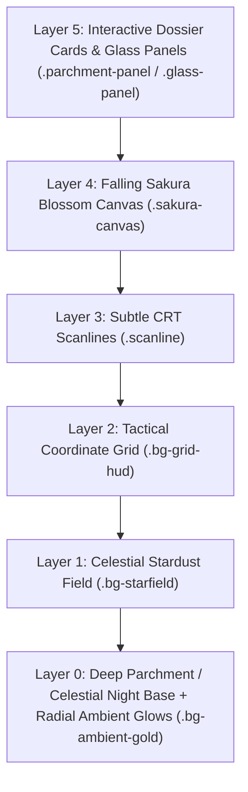

# DESIGNS.md — Master UI/UX Design System Specification

> **AETHER-HUD Design System: Teyvat Codex & Celestial Gaming HUD Edition**  
> **Aesthetic Philosophy:** Luxury Fantasy Cybernetics / High-End Game Dossier (AAA Action RPG HUD)  
> **Inspirations:** *Genshin Impact* (Teyvat Codex, Traveler Dossier, Inazuma Celestial Night), *Honkai: Star Rail* (Astral Geometry), *Cyberpunk & Tactical HUDs* (Monospace Telemetry & Angular Precision).

---

## 1. Design Philosophy & Vision

The **AETHER-HUD (Teyvat Codex Edition)** unites the warmth and editorial elegance of an ancient illuminated traveler's chronicle with the responsiveness of a modern high-tier gaming interface. Every panel, card, and telemetry node functions as an active subsystem node in an expansive digital world.

### Core Aesthetic Pillars:
1. **Dual-Mode Chromatic Harmony:**
   - **Teyvat Codex (Default / Warm Mode):** Warm ivory parchment (`#F9F6EE`), saddle leather & caramel tones (`#8C6239`, `#603813`), and warm imperial gold accents (`#C69214`, `#E5B842`).
   - **Inazuma Celestial Night (Dark Mode):** Deep midnight indigo (`#070913`), glowing violet/cyan energy conduits (`#9D72FF`, `#00D2FF`), and translucent obsidian glass.
2. **7 Elemental Resonance Palette:**
   - **Pyro:** Blazing Vermilion (`#FF5E41`) — AI Platform / Creative Engines.
   - **Hydro:** Cerulean Azure (`#29B6F6`) — Full-stack architectures & data streams.
   - **Anemo:** Radiant Teal (`#4DD0E1`) — Core languages, agility & speed.
   - **Electro:** Violet Pulse (`#B388FF`) — Real-time WebSockets & event streaming.
   - **Dendro:** Lush Jade (`#7CB342`) — Autonomous agents & ecosystem logic.
   - **Cryo:** Glacial Frost (`#80DEEA`) — Zero-trust security & immutable cryptography.
   - **Geo:** Amber Gold (`#FFB74D`) — Resilient databases & distributed cloud infrastructure.
3. **Editorial & Ornate Geometry:**
   - Chamfered corner cuts (45-degree tactical polygon cuts: `.chamfered`, `.chamfered-sm`, `.chamfered-lg`).
   - Ornate filigree framing, top-right bookmark ribbons with heart seals, and subtle watermark crests.
   - Monospace telemetry tags (`SYS_NODE // 0x482A`, `VISION // PYRO`, `RARITY // 5-STAR`).
4. **Living Atmosphere & Kinetic Micro-Interactions:**
   - Falling sakura blossom petals and subtle celestial stardust ambient particle canvas.
   - "Click to Proceed" Intro Gate with 7 pulsing elemental runes.
   - Smooth easing curve `cubic-bezier(0.16, 1, 0.3, 1)` with full `prefers-reduced-motion` compliance.

---

## 2. Non-Negotiable Anti-Generic Rules

> [!CAUTION]
> **STRICT PROHIBITION OF GENERIC ROUNDED CORNERS & DEFAULT TEMPLATING**  
> Never use standard web roundings (`rounded-md`, `rounded-lg`, `rounded-xl`, `rounded-2xl`, `rounded-full`) on core tactical panels, cards, buttons, or badges.  
> **Always** use chamfered polygon clipping (`.chamfered`, `.chamfered-sm`, `.chamfered-xs`, `.chamfered-lg`, `.tactical-btn`), ornate Teyvat borders, or sharp HUD framing.

| Generic Web Default (FORBIDDEN ❌) | Teyvat Codex Standard (REQUIRED ✅) |
|---|---|
| `rounded-lg` / `rounded-xl` / `rounded-2xl` on cards | `chamfered` / `chamfered-sm` with `parchment-panel` or `glass-panel` |
| `rounded-md` on buttons | `tactical-btn` or `teyvat-btn` with gold sheen sweep |
| Standard round pill badges (`rounded-full`) | `tech-badge` (hexagonal clip-path) or `vision-badge` |
| Generic circular spinners (`animate-spin`) | `hud-spinner` (diamond 45° rotation) or `elemental-rotate` |
| Plain solid grey input boxes | `input-recessed` with warm leather/gold border and focus glow |
| Continuous unbroken progress bars | `segment-bar` with elemental active blocks |

---

## 3. Complete Design Token Registry

All tokens are defined in [src/app/globals.css](file:///Volumes/Reinshy/Workspace/Personal/Aether%20HUD/aether-hud/src/app/globals.css) via Tailwind CSS v4 `@theme inline`.

### 3.1. Surface & Background Tokens

```css
/* Teyvat Codex (Default / Warm Mode) */
--color-parchment-base: #F9F6EE;     /* Base warm ivory canvas */
--color-parchment-subtle: #F3EEDF;   /* Secondary parchment tone */
--color-surface-parchment: #EFE8D6;  /* Elevated parchment surface */
--color-leather-dark: #3A2618;       /* Rich dark saddle leather text */
--color-leather-caramel: #8C6239;    /* Caramel leather border & accent */
--color-leather-muted: #735741;      /* Muted leather metadata text */

/* Inazuma Celestial Night (Dark Mode / [data-theme="night-ops"]) */
--color-deep-space: #070913;         /* Deepest midnight viewport background */
--color-surface-primary: #0D1122;    /* Primary dark container surface */
--color-surface-overlay: rgba(13, 17, 34, 0.78); /* High-density glass backdrop */
--color-glass-card: rgba(22, 28, 52, 0.50);      /* Translucent night glass */
```

### 3.2. Metallic & Accent Color Scales

#### Imperial Gold Scale (Primary Luxury Accent)
| Token | Hex Value | Usage |
|---|---|---|
| `--color-gold-50` | `#FEFAEE` | Brightest highlight / sparkle |
| `--color-gold-100` | `#FDF2CA` | High-contrast metallic text accent |
| `--color-gold-200` | `#FCE69C` | Light hover state |
| `--color-gold-300` | `#F9D66E` | Hover active glow |
| `--color-gold-400` | `#F2C94C` | **Primary Brand Gold** (Buttons, active borders) |
| `--color-gold-500` | `#DFAE2A` | Gradient end-stop / Darker gold |
| `--color-gold-600` | `#B8881A` | Ornate borders & filigree accents |
| `--color-gold-700` | `#936B14` | Deep gold borders |
| `--color-gold-800` | `#6E4F0E` | Ambient low-contrast gold |
| `--color-gold-900` | `#4A3509` | Shadow / Under-glow tone |

#### 7 Elemental Vision Scales
| Element | Primary Hex | Glow / Accent Hex | Semantic Role |
|---|---|---|---|
| **Pyro** | `#FF5E41` | `rgba(255, 94, 65, 0.35)` | AI Platform / Creative Engine |
| **Hydro** | `#29B6F6` | `rgba(41, 182, 246, 0.35)` | Full-Stack / Data Pipelines |
| **Anemo** | `#4DD0E1` | `rgba(77, 208, 225, 0.35)` | Core Languages / High Performance |
| **Electro** | `#B388FF` | `rgba(179, 136, 255, 0.35)` | Real-Time / WebSockets / Queues |
| **Dendro** | `#7CB342` | `rgba(124, 179, 66, 0.35)` | Autonomous AI Agents / Logic |
| **Cryo** | `#80DEEA` | `rgba(128, 222, 234, 0.35)` | Zero-Trust Security / Cryptography |
| **Geo** | `#FFB74D` | `rgba(255, 183, 77, 0.35)` | Distributed DBs / Cloud Infrastructure |

---

## 4. Typography Hierarchy & System Labels

Typography pairs majestic classical display serif with crisp high-legibility sans-serif and monospaced telemetry:

```
Display Headings  ──► Cinzel / Orbitron (Majestic, Classical, All-Caps, Tracked)
Body & Narrative  ──► Plus Jakarta Sans / Inter (Clean, Warm, High Legibility)
Telemetry & Code  ──► JetBrains Mono (Monospace, Precise, Tabular)
```

### 4.1. Text Styling Classes

- **Display Title Serif:**
  ```html
  <h1 class="font-display text-4xl sm:text-6xl font-bold tracking-wider uppercase text-leather-dark dark:text-platinum-50">
    THE TRAVELER // 旅人
  </h1>
  ```
- **Monospace System Label:**
  ```html
  <span class="sys-label font-mono text-[10px] tracking-widest uppercase text-leather-muted dark:text-text-muted">
    SYS_REF // 0x482A
  </span>
  ```
- **Active Gold Telemetry Label:**
  ```html
  <span class="sys-label-gold">
    VISION_STATUS // ACTIVE
  </span>
  ```
- **Active Online Indicator:**
  ```html
  <span class="sys-label-active">ONLINE</span>
  ```

---

## 5. Geometry, Clipping & Tactical Embellishments

### 5.1. Chamfered Corner System (45-Degree Polygon Clipping)

```css
/* Standard Card Cut (16px top-right and bottom-left) */
.chamfered {
  clip-path: polygon(0 0, calc(100% - 16px) 0, 100% 16px, 100% 100%, 16px 100%, 0 calc(100% - 16px));
}

/* Small Card / Tag Cut (8px) */
.chamfered-sm {
  clip-path: polygon(0 0, calc(100% - 8px) 0, 100% 8px, 100% 100%, 8px 100%, 0 calc(100% - 8px));
}

/* Micro Cut (4px for small status pills) */
.chamfered-xs {
  clip-path: polygon(0 0, calc(100% - 4px) 0, 100% 4px, 100% 100%, 4px 100%, 0 calc(100% - 4px));
}

/* Large Hero Panel Cut (24px) */
.chamfered-lg {
  clip-path: polygon(0 0, calc(100% - 24px) 0, 100% 24px, 100% 100%, 24px 100%, 0 calc(100% - 24px));
}

/* Tactical Button Double Cut (12px top-left and bottom-right) */
.tactical-btn {
  clip-path: polygon(12px 0, 100% 0, 100% calc(100% - 12px), calc(100% - 12px) 100%, 0 100%, 0 12px);
}
```

### 5.2. Teyvat Ornate Embellishments

- **`.bookmark-ribbon`:** Ornate top-right bookmark ribbon with heart emblem icon.
- **`.vision-badge`:** Hexagonal clipped badge with elemental tint and gold border.
- **`.corner-brackets`:** Glowing gold top-left and bottom-right brackets framing the container.
- **`.corner-decor`:** Monospace `+` sign at the bottom-left corner.
- **`.diamond-corner`:** Subtle `◆` diamond symbol in the upper right.

---

## 6. Atmosphere & Background Layering

Depth is created through layered atmospheric overlays simulating a living fantasy skybox:



---

## 7. Component Blueprints & Code Standards

### 7.1. Hero Traveler Dossier Panel
```html
<div class="chamfered-lg parchment-panel dark:glass-panel p-6 lg:p-10 relative overflow-hidden">
  <!-- Bookmark Ribbon -->
  <div class="bookmark-ribbon" aria-label="Featured Dossier">
    <svg class="h-4 w-4 text-white" ...></svg>
  </div>
  
  <div class="grid grid-cols-1 lg:grid-cols-12 gap-8 items-center">
    <!-- Character Figure & Silhouette -->
    <div class="lg:col-span-5 relative">
      <div class="figure-shadow-layer"></div>
      
    </div>

    <!-- Dossier Content & Accordions -->
    <div class="lg:col-span-7 space-y-6">
      <span class="sys-label">The Traveler // 旅人</span>
      <h1 class="font-display text-4xl lg:text-6xl font-bold text-leather-dark dark:text-platinum-50">
        Aether
      </h1>
      <p class="text-leather-muted dark:text-text-muted font-body leading-relaxed">
        Full-Stack Architect & AI Engineer journeying across digital realms...
      </p>
    </div>
  </div>
</div>
```

### 7.2. Teyvat Artifact Project Card (5-Star)
```html
<div class="chamfered parchment-panel dark:glass-panel p-6 card-lift relative group">
  <div class="flex items-center justify-between mb-3">
    <span class="vision-badge vision-pyro">PYRO // AI</span>
    <div class="star-rating text-gold-400">★★★★★</div>
  </div>
  <h3 class="font-display text-lg font-bold text-leather-dark dark:text-platinum-50 uppercase">
    AniVerse
  </h3>
  <p class="text-leather-muted dark:text-text-muted text-sm mt-2">
    AI-powered anime generative art platform with real-time neural pipeline.
  </p>
  <div class="mt-4 pt-4 border-t border-leather-caramel/20 flex gap-2">
    <a href="..." class="tactical-btn btn-glow-sweep px-4 py-1.5 text-xs font-mono bg-gold-400 text-deep-space">
      LAUNCH MISSION
    </a>
  </div>
</div>
```

### 7.3. Segment Progress Bar (Elemental Resonance)
```html
<div class="skillbar-hover space-y-1.5">
  <div class="flex justify-between items-center text-xs font-mono">
    <span class="text-leather-dark dark:text-platinum-100 font-semibold">NEXT.JS / REACT</span>
    <span class="text-gold-600 dark:text-gold-400 font-bold">99%</span>
  </div>
  <div class="segment-bar" role="progressbar" aria-valuenow="99" aria-valuemin="0" aria-valuemax="100">
    <div class="segment active"></div>
    <div class="segment active"></div>
    <div class="segment active"></div>
    <div class="segment active"></div>
    <div class="segment active"></div>
    <div class="segment active"></div>
  </div>
</div>
```

---

## 8. Motion, Easing & Micro-Interactions

### 8.1. Easing Standard
All transitions and animations must strictly utilize the Teyvat HUD deceleration easing curve:
```css
cubic-bezier(0.16, 1, 0.3, 1)
```

### 8.2. Accessibility & Reduced Motion
```css
@media (prefers-reduced-motion: reduce) {
  *, *::before, *::after {
    animation-duration: 0.01ms !important;
    animation-iteration-count: 1 !important;
    transition-duration: 0.01ms !important;
  }
}
```

---

## 9. Official Genshin UI Icon System

All UI iconography across navigation, headings, cards, and interactives must utilize the official Genshin Impact UI icons registered in [references/UI_ICONS.md](file:///Volumes/Reinshy/Workspace/Personal/Aether%20HUD/aether-hud/references/UI_ICONS.md) and exported via [src/lib/ui-icons.ts](file:///Volumes/Reinshy/Workspace/Personal/Aether%20HUD/aether-hud/src/lib/ui-icons.ts).

### 9.1. Core Icon Mappings:
| UI Component | Official Genshin UI Icon | Path |
|---|---|---|
| **Traveler / Profile** | `Icon Character Aether` | `/ui-icons/Icon%20Character%20Aether.png` |
| **Domains / Projects** | `Icon Domain` / `Icon Artifacts` | `/ui-icons/Icon%20Domain.png` |
| **Talents / Skills** | `Icon Talents` | `/ui-icons/Icon%20Talents.png` |
| **Crown / Max Mastery** | `Item Crown of Insight` | `/ui-icons/Item%20Crown%20of%20Insight.png` |
| **Quests / Handbook** | `Icon Adventurer Handbook` / `Icon Quests` | `/ui-icons/Icon%20Adventurer%20Handbook.png` |
| **Rewards (Primogem & Mora)**| `Item Primogem` / `Item Mora` | `/ui-icons/Item%20Primogem.png` |
| **Companions / Allies** | `Icon Friends` / `Icon Serenitea Pot` | `/ui-icons/Icon%20Friends.png` |
| **Dispatch Shrine / Mail** | `Icon Mail` / `Icon Wish` | `/ui-icons/Icon%20Mail.png` |
| **Archive / Codex** | `Icon Archive` | `/ui-icons/Icon%20Archive.png` |
| **Clock / Time** | `Icon Time` | `/ui-icons/Icon%20Time.png` |

